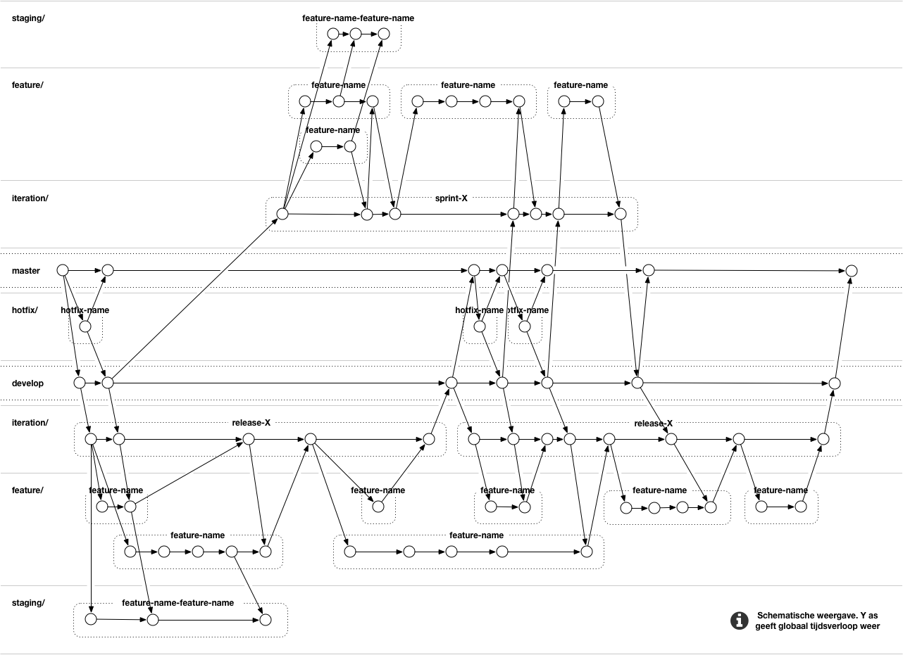

# Branches

## Names

### Master
`master`

Directly committing in the master branch is not allowed. Only a merge from develop or from a hotfix can be merged with master. The lastest version (tag) in the master branch is the version that is currently (or will soon be live). When merging a hotfix or develop with the master branch a version (tag)

### Develop
`develop`

Iteration, hotfixes and feature branches are merged in develop. From this branch you can test how, for example, a release and a sprint branch work together. Please note that you may only merge to develop if your work has been tested, reviewed and ready to go live.

### Hotfixes
`hotfix/my-super-fix`

When there are bugs in the latest master branch that need to be fixed as soon as possible they can be fixed by an hotfix. Hotfixes are patches on live websites. They are always branched of the master branch. When the hotfix is finished and tested it can be merged directly into master. If there is a new version on develop this can also be pulled and merged before merging to master because the latest version of develop is always ready to go live.

### Iteration
`iteration/sprint-7`

An iteration branch is a collection of features. In a sprint it is useful to have all the completed feature branches together to be able to deploy or test the combined result. When you start a new iteration you always branch of develop. Directly developing on this branch is not allowed, always create a feature. When the sprint is complete, the latest version of develop is first pulled and merged into the iteration before merging it back to develop.

### Features
`feature/JIRA-10-remove-tim-from-credits`

Feature branches are the only branches that can be actively developed and are always a branch of develop or an iteration. A feature is always a deliverable piece of code and must be reviewable.

When you start a feature from an iteration, first make sure that the associated iteration is up to date with the develop branch. When you are finished developing the feature, always merge the latest version of the iteration or develop (based upon what your target branch is) into your feature to prevent merge issues. After merging always retest your code to make sure that your code still works because other developers might have deleted something you need.

Features are not bound to an iteration or develop. For example they can start in an iteration like 'sprint-1' but get merged into develop long after 'sprint-1' has been merged.

When multiple user stories or release points have a lot of overlap then they can be developed in a feature branch. You can do this by putting multiple Jira IDs in the branch name, but it is more convenient for the overview to merge the issues in Jira when possible. Do not confuse this with the staging branch that is used for testing / visualizing feature branches together. It is up to the developer to determine at his own discretion when multiple features need to be picked up in one feature branch, but always consult with the customer.

### Staging
`staging/JIRA-10-11-12-14`

Staging branches are collections for features. Here you can merge features that are ready to test and review together. The difference with the iteration branch is that you do not yet know whether it is working properly and whether it satisfies the customer's requirements.

When one feature needs to be removed from a staging branch, for whatever reason, the staging branch needs to be recreated from the most recent version of the iteration branch.

Staging branches are never merged and must be removed when you have finished testing and when the customer has approved the staged features. If you want to have one feature approved by the customer, you obviously do not need a staging branch.

## Possible names
- master
- develop
- hotfix/(Jira-id-)description (for example: hotfix/JIRA-123-update-git-docs or hotfix/update-git-docs)
- iteration/sprint-number or iteration/description (for example: iteration/sprint-7 or iteration/redesign-homepage)
- feature/(Jira-id(s)-)description (for example: feature/JIRA-123-update-git-docs of feature/update-git-docs)
- staging/(Jiri-ids-)description (for example: staging/JIRA-123-567-redesign-homepage of staging/redesign-homepage

## Visual overview
